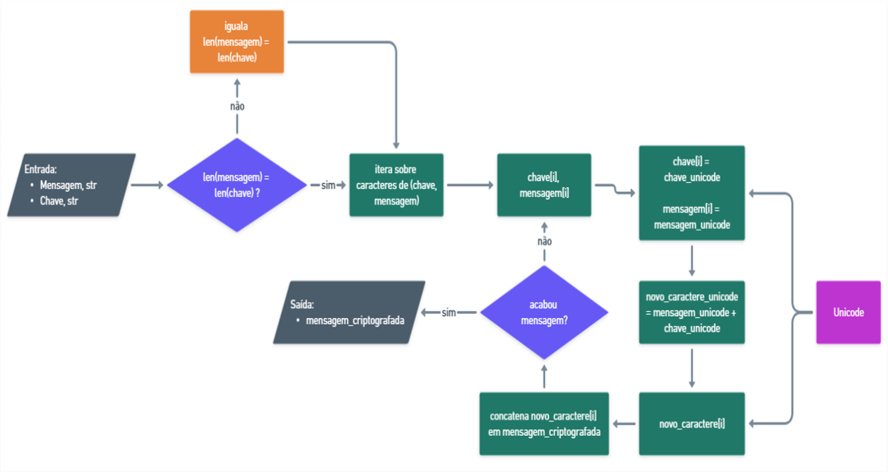

# Codificação e decodificação de mensagens com Python

### O projeto foi realizado pela equipe:
- [Katharine Olegario](https://github.com/KatharineOlegario) 
- [Wiliams Alves](https://github.com/alves05) 
- [Adam Basílio](https://github.com/abasilio91)
- [Lucas Félix](https://github.com/lucaxfelis)
- [Gabriel](https://github.com/gabrielbsb82)
- [Henrique Freitas](https://github.com/henriqsf)

## Contextualização

A PyCoders Ltda., cada vez mais especializada no mundo da Inteligência Artificial e Ciência de Dados, foi procurada por uma fintech para desenvolver um projeto codificação de dados. 

A fintech percebeu que muitas das informações usadas na área de inteligência de negócios, estão sendo roubadas por uma empresa concorrente! 

Para lidar com esse problema, um dos funcionários sugeriu que os dados sejam codificados usando uma chave secreta, e unicamente quem souber a chave secreta poderá conseguir decodificar a mensagem e visualizar os dados originais.

Como existe muito risco de a chave vazar e de qualquer forma os dados serem roubados, a chave tem que ser alterada com frequência, fazendo desta forma que a codificação seja dependente da senha! 

Por exemplo:

Se eu tiver a mensagem: 'Hello world!'
- A mensagem codificada com uma chave aleatória X, poderia ser: ```'bdgdjh3bvd8397'```

- E, a mesma mensagem codificada com uma chave aleatória Y, poderia ser: ```'oouyrjrhyw26'```

## Obejtivo de projeto

O objetivo deste projeto é codificar e decodificar mensagens usando uma chave comum.

1. Neste projeto, os usuários devem inserir a mensagem para codificar ou decodificar. 
2. Os usuários devem selecionar o modo para escolher o processo de codificação e decodificação. 
3. A mesma chave deve ser usada para processar a codificação e decodificação da mesma mensagem.

## Sobre o projeto

## Arquivos 

- [Programa de Criptografia]("./code/cripita_decripita.py")
- [Teste do cripita_decripita.py]("./tests/test_cripita_decripita.py")
- [Outros Arquivos]("./others/")
- [License]("LICENSE")

### O Método de Criptografia:

O método escolhido para este projeto foi a Cifra de Vigènere, que é classificada como um método *polialfabética*. O método recebe como entrada uma mensagem e uma chave alfanumérica. Este pode ser entendido como uma sequência de Cifras de César, em que cada caractere da mensagem é criptografada separadamente de acordo com o respectivo caractere da chave alfanumérica na mesma posição relativa. A equação que rege a criptografia segue abaixo:

```Ci = Pi + Ki  mod m```

Em que:
- Ci: Caractere cifrado do texto final na posição i (CipherText).
- Ki: Caractere da chave  na posição i .
- Pi: Caractere do texto original  na posição i (PlainText).
- m: Tamanho do vetor de referência.


Originalmente, a Cifra de Vigènere utiliza o alfabeto latino como vetor de referência, ou seja, m=26. Sendo assim, apesar de ter sido considerada altamente eficiente quando foi proposta, no século XVI, hoje pode ser facilmente quebrada com técnicas modernas de criptoanálise. Para aumentar o nível de dificuldade, esta implementação utiliza as funções ```chr()``` e ```ord()```, nativas do Python, para codificar as letras utilizando suas referências em Unicode, não estando limitada à apenas os 26 caracteres do alfabeto latino, já que a função ```chr()```, responsável por traduzir um valor numérico em um símbolo Unicode, aceita entradas entre 0 e 1.114.111.

- Prós:
    - Fácil compreensão e implementação
    - Maior variedade de caracteres comparada às implementações da literatura
    - Capaz de lidar com caracteres especiais e espaços
- Contras:
    - Quebrável através de criptoanálise (Ataque de Kasiski e Friedman)


    *Fluxograma do algoritmo de Vigènere.*


<details>

<summary>Referências:</summary>


- [Built-in Functions#ord — Python 3.7.17 documentation](https://docs.python.org/3.7/library/functions.html#ord)
- [Built-in Functions#chr — Python 3.7.17 documentation](https://docs.python.org/3.7/library/functions.html#chr)
- [Codificar e Decodificar Usando a Cifra de Vig - wikiHow](https://pt.wikihow.com/Codificar-e-Decodificar-Usando-a-Cifra-de-Vig)
- [Cifra de Vigenère – Wikipédia, a enciclopédia livre (wikipedia.org)](https://pt.wikipedia.org/wiki/Cifra_de_Vigen%C3%A8re)
- [An-Enhanced-Vigenere-Cipher-For-Data-Security-libre.pdf (d1wqtxts1xzle7.cloudfront.net)](https://d1wqtxts1xzle7.cloudfront.net/44594117/An-Enhanced-Vigenere-Cipher-For-Data-Security-libre.pdf?1460300129=&response-content-disposition=inline%3B+filename%3DAn_Enhanced_Vigenere_Cipher_For_Data_Sec.pdf&Expires=1698356584&Signature=USa1XFc1UyD9uB4L6sKdPYgVVDqZwDWoAIy80zv1~ruyf5qHrnylBUFcKik6nUxsuTZBbjCYnWweaji0jaORTsC38IqeHLAP8zwJd8ISiijFj8v0KexdUdBVLYenXHFZf-HbGXIOKjgRHe4d5-6Qow4q0P7XyTC-aBI7-eZe0P357M4XlYWKrAKMoRcl19lX7DbOqyX7Lw-Xa4iDpflr15uYP3Us8HMPyVCjXOyMDZ1di~c4C7fdu0otx7AbKhCrX1rDgXviJUmx~EPOeUI5IjtdCEQ2gJJQpiBdEDiL-vCX7BdoT0YLo2GXtUgWCaDV0iY~-jSGwoffTrdjlSVj6Q__&Key-Pair-Id=APKAJLOHF5GGSLRBV4ZA)
- [Data Security Using Vigenere Cipher and Goldbach Codes Algorithm (researchgate.net)](https://www.researchgate.net/profile/Robbi-Rahim/publication/312651703_Data_Security_Using_Vigenere_Cipher_and_Goldbach_Codes_Algorithm/links/588762edaca272b7b4522a6a/Data-Security-Using-Vigenere-Cipher-and-Goldbach-Codes-Algorithm.pdf)
- [aliyu-2016-ijca-908549-libre.pdf (d1wqtxts1xzle7.cloudfront.net)](https://d1wqtxts1xzle7.cloudfront.net/52095035/aliyu-2016-ijca-908549-libre.pdf?1489104159=&response-content-disposition=inline%3B+filename%3DVigenere_Cipher_Trends_Review_and_Possib.pdf&Expires=1698365495&Signature=Qv3AM6X~3NVg5OaLdRXoJMxQlOuy~VZ2kRyHQtiETloCC1Y-H60CYuqc3g-hVKDup~Liqiol-JVcgEyUpozqRO~sNslxw3oGSdZ~wlQZtF4Fe7Pkzt58B5J-OmPAgmeFjoXzMfrF7YVYdMs4RMRMUS5x3XohQS-urWOmavmyf6k-fWGyMcPnq2T2TdaS7htOxl68CHke0xyZbllmwv7atXwPr4oj9P5rav4Ni~pkoZpL5mcdoh8sxQvMvIQdY~qGH37h0a7lX5pNUucsHDerUQzE7~YFbuOGrwcuOtqJZikvlMOmHOKhkI8fbkk~VEd832C~tXIYRMEWmcBcfA14yg__&Key-Pair-Id=APKAJLOHF5GGSLRBV4ZA)

</details>


## Funções criadas no programa cripita_decripita.py

<details>

<summary>1. função codificar(mensagem:str, chave:str):</summary>

- Aplica o método da Cifra de Vigènere na codificação.

    - ENTRADA:
        - mensagem, ```str```: Texto que irá ser criptografado.
        - chave, ```str```: Senha alfanumérica que irá definir a offset do texto.

    - SAÍDA:
        - mensagem_codificada, ```str```: Mensagem criptografada.

```
'''Função que criptografar a mensagem.'''
def codificar(mensagem : str, chave : str):
    mensagem_codificada = ""

    '''Garante que a chave e a mensagem tenham o mesmo tamanho.'''
    if len(chave) < len(mensagem):
        while len(chave) < len(mensagem):
            chave += chave
    
    chave = chave[:len(mensagem)]

    for car_chave, car_mensagem in zip(chave, mensagem):
        offset = transforma_chave(car_chave)
        mensagem_codificada += chr((ord(car_mensagem) + offset) % ascii_extensao())
    
    return mensagem_codificada
```

</details>

<details>

<summary>2. função decodificar(mensagem:str, chave:str):</summary>

- Aplica o método da Cifra de Vigènere na decodificação.

    - ENTRADA:
        - mensagem, ```str```: Texto que irá ser descriptografado.
        - chave, ```str```: Senha alfanumérica que foi fornecida na criptografia da mensagem original que irá definir a offset do texto.

    - SAÍDA:
        - mensagem_decodificada, ```str```: Mensagem descriptografada.

```
'''Função que descriptografa a mensagem.'''
def decodificar(mensagem : str, chave : str):
    mensagem_decodificada = ""

    '''Garante que a chave e a mensagem tenham o mesmo tamanho.'''
    if len(chave) < len(mensagem):
        while len(chave) < len(mensagem):
            chave += chave
    
    chave = chave[:len(mensagem)]

    for car_chave, car_mensagem in zip(chave, mensagem):
        offset = transforma_chave(car_chave)
        mensagem_decodificada += chr((ord(car_mensagem) - offset) % ascii_extensao())

    
    return mensagem_decodificada
```

</details>

<details>

<summary>3. função transforma_chave(chave:str):</summary>

- Aplica a mudança da chave para o formato numérico e multiplo de 26.

    - ENTRADA:
        - chave, ```str```: Senha alfanumérica que irá ser transformada em numérica.

    - SAÍDA:
        - chave_numerica, ```int```: Retorna a chave em formato numérico multiplo de 26.

```
'''Função que transforma a chave.'''
def transforma_chave(chave : str):
    chave = str(chave)
    chave_numerica = 0

    for caractere in str(chave):
        chave_numerica += ord(caractere)
    
    return chave_numerica % alfabeto_extensao()
```

</details>

<details>

<summary>4. função ascii_extensao():</summary>

- Retorna o intervalo válido para o argumento da função ```chr()``` vai de ```0 até 1.114.111```.

```
'''Define o intervalo válido da funação chr().'''
def ascii_extensao():
    invervalo = 1114112
    return invervalo
```

</details>

<details>

<summary>5. função alfabeto_extensao():</summary>

- Retorna o intervalo de ```26``` caracteres conrespondetes a o alfabeto pt-br.

```
'''Define o intervalo do alfabeto português-BR.'''
def alfabeto_extensao():
    extensao = 26
    return extensao
```

</details>

## Teste automatizado
As funções criadas no teste tem o objetivo de validar e testar o programa de criptografia.

<details>

<summary>1. função teste_cripita_decripita(mensagem:str, chave:str):</summary>

- Aplica o teste nas funções ```codificar(mensagem:str, chave:str)``` e ```decodificar(mensagem:str, chave:str)```

    - ENTRADA:
        - mensagem, ```str```: Mensagem a ser criptografada
        - chave, ```str```: Senha alfanumérica que irá definir a offset do texto.

    - SAÍDA:
        - mensagem == mensagem_decodificada, ```str```: Validação, apos a criptografia irá verificar se a mensagem foi descriptografada corretamente, retorno esperado *True*.

```
def teste_cripita_decripita(mensagem : str, chave : str):
    mensagem_codificada = codificar(mensagem=mensagem, chave=chave)
    mensagem_decodificada = decodificar(mensagem=mensagem_codificada, chave=chave)

    return mensagem == mensagem_decodificada
```

</details>


<details>

<summary>2. função teste_transforma_chave(chave:str):</summary>

- Aplica o teste na função ```transforma_chave(chave:str)```

    - ENTRADA:
        - chave, ```str```: Senha alfanumérica que irá ser transformada em numérica.

    - SAÍDA:
        - transforma_chave(chave) % 26 == 0, ```int```: Validação, caso a função ```transforma_chave(chave:str)``` retorne um número multiplo de 26 o retorno esperado é *True*.

```
def teste_transforma_chave(chave : str):
    return transforma_chave(chave) % 26 == 0
```

</details>